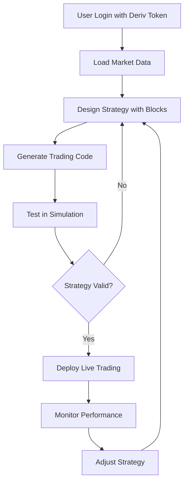

# Project Summary: JarvisLab Deriv Trading Platform

## Overview
This is a sophisticated web-based trading automation platform built on Google Blockly that connects to Deriv (binary options trading platform) via WebSocket API. The application allows users to create, test, and deploy automated trading strategies using a visual block programming interface.

## Core Purpose
The platform enables traders to:
1. **Design trading algorithms** visually using Blockly blocks instead of writing code
2. **Connect to Deriv accounts** via API tokens for real trading
3. **Automate trading decisions** based on market data, indicators, and custom logic
4. **Backtest and simulate** strategies before deploying with real money
5. **Monitor trading performance** with real-time dashboards and notifications

## Key Components

### 1. **Blockly Visual Programming Environment**
- **Custom Block Definitions**: Over 200+ specialized trading blocks in [`Block_Definition.js`](Block_Definition.js)
- **Generator Stubs**: JavaScript code generation in [`Generator_Stub.js`](Generator_Stub.js)
- **Toolbox Configuration**: Organized block categories in [`toolbox (4).xml`](toolbox%20(4).xml)
- **Workspace Management**: Main workspace with drag-and-drop block programming

### 2. **Trading Engine & Bot Functionality**
- **Real-time Market Data**: Fetches active symbols, contracts, and pricing from Deriv
- **Automated Trading Loop**: Executes trades based on block-defined logic
- **Risk Management**: Includes stop-loss, take-profit, and position sizing controls
- **Virtual Hooks**: Advanced features for conditional trading and strategy switching

### 3. **User Interface & Experience**
- **Modern Dark Theme**: Premium futuristic design with green accents
- **Responsive Layout**: Workspace, code panel, and control panels
- **Account Management**: Multi-account support with balance tracking
- **Real-time Notifications**: Toast system for alerts and errors

## Technical Architecture

### Frontend Stack
- **HTML/CSS/JavaScript**: Vanilla implementation with no frameworks
- **Google Blockly**: Core visual programming library
- **WebSocket API**: Real-time connection to Deriv servers
- **Custom CSS**: Advanced styling with modern design system

### Project Structure
```
├── index.html              # Main application interface
├── script.js              # Core trading logic & Blockly initialization (3231 lines)
├── styles.css             # Comprehensive styling (2359 lines)
├── Block_Definition.js    # Custom Blockly block definitions (2078 lines)
├── Generator_Stub.js      # JavaScript code generation for blocks (554 lines)
├── toolbox (4).xml        # Blockly toolbox configuration
├── assets/                # Images and overlays
├── data/                  # Additional CSS and JS files
└── plans/                 # Documentation and planning
```

## Key Features

### Trading Capabilities
1. **Market Selection**: Hierarchical market/submarket/symbol selection
2. **Contract Types**: Support for various Deriv contract types (Rise/Fall, Digits, etc.)
3. **Trade Settings**: Configurable stake, duration, and risk parameters
4. **Conditional Logic**: If/else, loops, variables for complex strategies
5. **Technical Indicators**: MACD, RSI, Bollinger Bands, moving averages
6. **Candle Analysis**: Open/close/high/low data with interval support
7. **Tick Analysis**: Real-time tick data processing and pattern detection

### Advanced Features
1. **Virtual Hook System**: Conditional strategy activation based on win/loss patterns
2. **Multi-Account Support**: Switch between different Deriv accounts
3. **Telegram Notifications**: Integration for remote alerts
4. **Performance Tracking**: Profit/loss calculation and statistics
5. **Error Recovery**: Automatic retry mechanisms for failed trades
6. **Code Export**: Generate JavaScript code from block diagrams

## Workflow



## Target Users
1. **Retail Traders**: Looking to automate their trading strategies
2. **Algorithmic Developers**: Wanting visual programming interface
3. **Trading Educators**: Teaching trading concepts with visual tools
4. **Strategy Testers**: Backtesting trading ideas without coding

## Integration Points
- **Deriv API**: WebSocket connection for real-time trading
- **Blockly Ecosystem**: Extensible with custom blocks
- **Telegram Bot API**: For notification delivery
- **Local Storage**: For saving workspace and user preferences

## Current State
The project appears to be a fully functional trading platform with:
- Complete Blockly integration with custom trading blocks
- Working WebSocket connection to Deriv
- Comprehensive trading logic implementation
- Polished UI with dark theme
- Advanced features like virtual hooks and indicators

## Potential Improvements
1. **Code Organization**: Large monolithic files could be modularized
2. **Error Handling**: More robust error recovery and user feedback
3. **Testing Framework**: Add unit tests for trading logic
4. **Documentation**: More detailed user guides and API documentation
5. **Performance Optimization**: Reduce bundle size and improve load times

## Conclusion
This is a sophisticated trading automation platform that successfully bridges visual programming with real financial trading. It provides a powerful yet accessible way for traders to implement automated strategies on the Deriv platform without needing to write complex code.